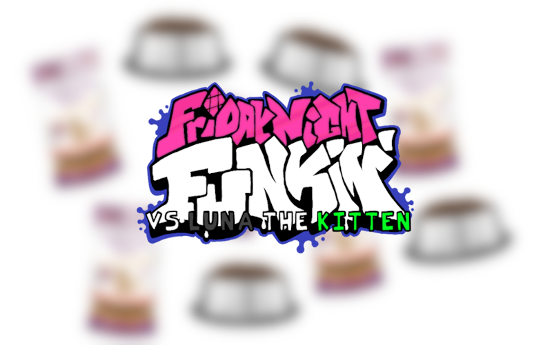

# VS LUNA (LUNA ENGINE)
this is dave

say hi to luna
please say hi to her

## About the mod
Powered by a heavily modified version of Kade Engine, The mod includes lots of additional improvements such as
- OpenGL Shaders
- Character Selector
- Modcharts
- [Strawberry Input](https://github.com/benjaminpants/Funkin-Strawberry)

If you're looking to compile the mod/make your own modification, [look into the modding guide and how to haxe](Modding.md).
